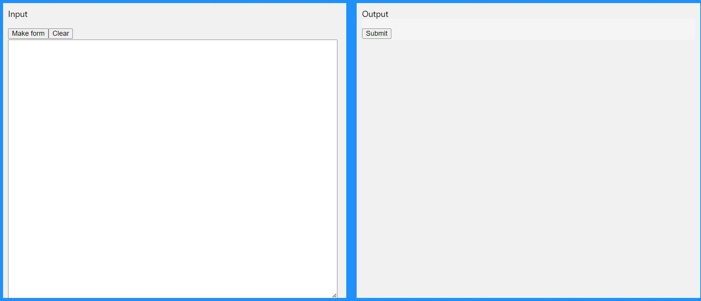
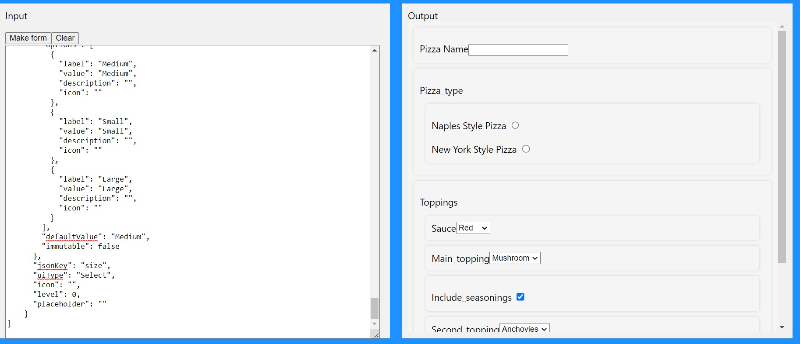
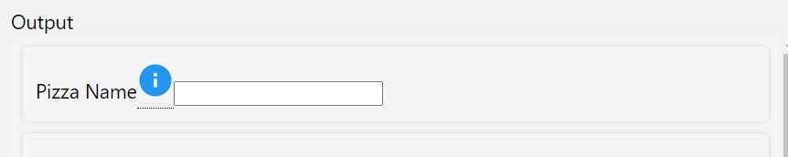
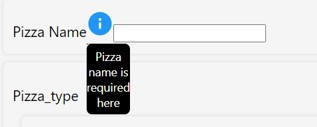
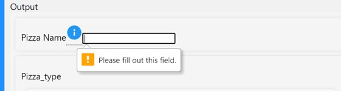
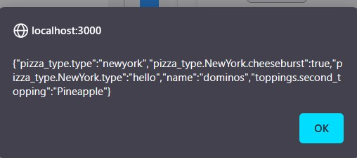

# Frontend-Assignment

[Live link](https://frontend-assignment-phi.vercel.app/)

[pizza.json](https://drive.google.com/file/d/1RUU_ueF9BbQRLReuX88w8PWe2jsz3Z3C/view?usp=sharing)

[pasta.json](https://drive.google.com/file/d/19_E6dSDUbiDR31wNSSvUARHxh1HeT6L4/view?usp=sharing)

## How to use:      

1. Paste the correct json with Uitype mentioned in the Assignment

Website apperance on loading 

2. Paste your json and click on makeform (incorrect json will result in alert error)

3. Info icon appears if description is not empty

 
 On hovering 

4. Required Field is necessary to be filled

# Output

All the information user changed can be seen here in alert

